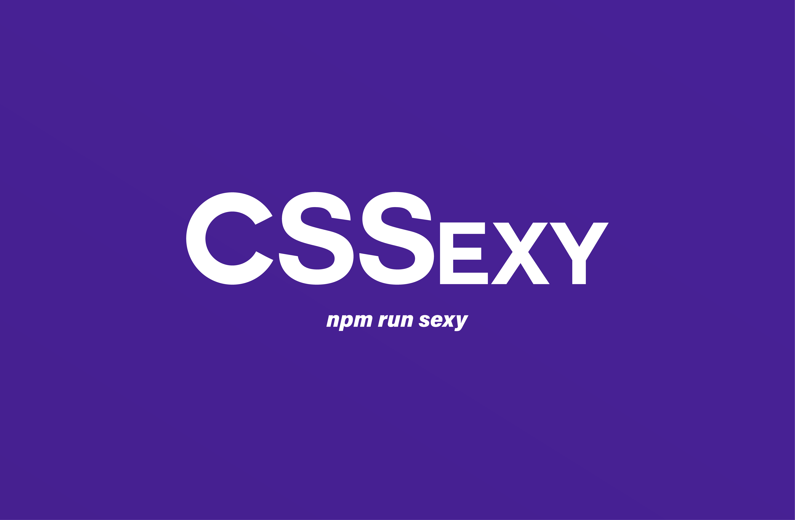

# CSSexy

<p align="center">
  
</p>

Because your website deserves to look hot.


## Table of Contents

- [Introduction](#introduction)
- [Features](#features)
- [Installation](#installation)
- [The CSSexy Team](#team)
- [Contributing](#contributing)
- [License](#license)

## Introduction

We are thrilled to unveil CSSexy, a powerful tool designed to streamline CSS editing and management within your web applications. CSSexy taps into the power of Puppeteer and Chrome Developer Tools to provide a comprehensive interface for viewing and modifying CSS styling rules in real time. You can view where in the source code that the CSS rule is applied, and modify that source with a simple, clean interface.

## Features

- Load your target applicaiton into CSSexy
- View CSS properties by clicking an element on the DOM
- Modify CSS properties in CSSexy and save changes to source code

## Installation

1. Clone the repo
2. Run your application on localhost:8000
3. Run the scripts to install dependencies and start the app

```bash
# Example installation steps
git clone https://github.com/oslabs-beta/cssexy.git
cd cssexy
npm install
npm run dev
```

## The CSSexy Team

|  Developed By   |                                                                       GitHub                                                                       |                                                                    LinkedIn                                                                    |
| :-------------: | :------------------------------------------------------------------------------------------------------------------------------------------------: | :--------------------------------------------------------------------------------------------------------------------------------------------: |
|   Mike Basta    |    [](https://github.com/mikebasta)    |    [](https://www.linkedin.com/in/mikebasta/)    |
| Elena Netepenko | [](https://github.com/Elena-Netepenko) | [](https://www.linkedin.com/in/elena-netepenko/) |
|    Rob Sand     |    [](https://github.com/rjsandman)    |         [](https://www.linkedin.com/in/)         |
|  Keith Gibson   |   [](https://github.com/keithgibson)   |  [](https://www.linkedin.com/in/keithrgibson/)   |
|                 |

## Contributing

Contributions are the foundation of the open-source community. Your contributions help improve our application for developers around the world and are greatly appreciated.

Feel free to fork the project, implement changes, and submit pull requests to help perfect this product and solve problems others might be facing.

If you like what CSSexy is doing, please star our project on GitHub! Stars will help boost CSSexy's visibility to developers who may find our product useful or be interested in contributing.

If you notice any bugs or would like to request features, please browse our [Issues page.](https://github.com/oslabs-beta/cssxe/issues)

## License

CSSexy is developed under the [MIT license.](https://en.wikipedia.org/wiki/MIT_License)
